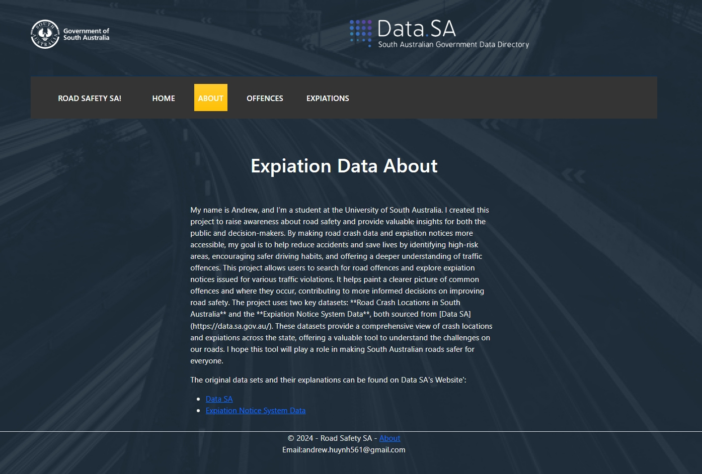

# Road Safety SA
Welcome to the **Road Safety SA** project! This project visualizes expiation data and road safety statistics in South Australia. With interactive maps and data dashboards, users can explore road safety information, expiation details, and understand how traffic regulations are enforced.
### 1. Interactive Map for DataCrash 
- Displays **Data Crash** across South Australia from 2018-2023(src:https://data.sa.gov.au/).
- Uses **ArcGIS API** for map visualizations, allowing users to explore data interactively.
- Highlights crash-prone areas and allows for zooming and exploration of specific regions.
## Technologies Used
- **ASP.NET Core MVC**: The web framework used for building the dynamic application.
- **Entity Framework Core**: For database access and querying the SQL Server database.
- **ArcGIS API**: For displaying expiations and crash data on a dynamic map.
- **D3.js**: For creating interactive charts and data visualizations.
- **Bootstrap**: For a responsive and modern user interface.
- **SQL Server**: The database used to store and query expiation and offence data.
- **ASP.NET Identity**: For implementing user authentication and authorization.
### 2. Data Dashboards and Visualizations 📊
- Displays **key statistics** such as total fines, average speeds, and offence frequency.
- Shows **drinking statistics** like BAC (Blood Alcohol Content) levels.

This project is about Road Safety in South Australia...
All data from :https://data.sa.gov.au/
